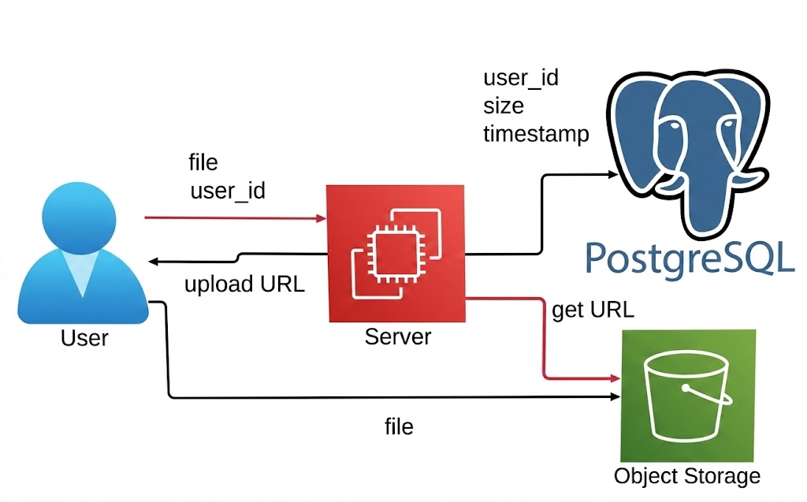
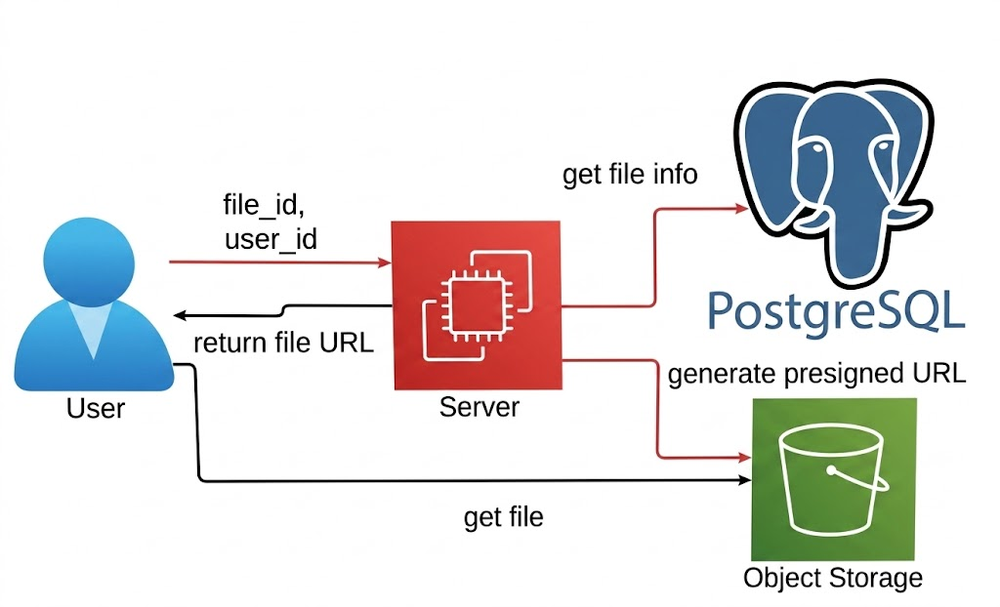

# MyDrive

File upload backend service built with **Django REST Framework** and **MinIO** (S3-compatible storage).

It uses presigned URLs for direct uploads and downloads between the client and storage, keeping heavy file traffic off the Django server while maintaining strict user authorization and file isolation.

## 🛠 Tech Stack

- **Language:** Python
- **Framework:** Django, Django REST Framework (DRF)
- **Storage SDK:** boto3
- **Object Storage:** MinIO
- **Database:** PostgreSQL
- **Containerization:** Docker, Docker Compose

## 🏗️ Architecture: Direct Storage Access Pattern

To eliminate server bottlenecks and offload heavy binary file I/O from the Django application server, this project implements the **Direct-to-Storage Pattern** using **S3 Presigned URLs**.

The Django API handles authentication, authorization, and metadata management in PostgreSQL, while the client interacts directly with MinIO for all file transfers.

### 1. Upload Flow



1. **Initiate Upload:** The client sends file metadata (`name`, `size`) to the Django API.
2. **Generate URL:** Django generates a secure, short-lived Presigned `PUT` URL via S3 SDK and saves the file metadata record in PostgreSQL.
3. **Return URL:** Django returns the unique `file_key` and `presigned_upload_url` to the client.
4. **Direct Transfer:** The client uploads the raw binary file directly to MinIO storage via HTTP `PUT`.

### 2. Download Flow



1. **Request Access:** The authenticated client requests a download link for a specific `file_id`.
2. **Permission & Metadata Check:** Django queries PostgreSQL to ensure the requesting user owns the file.
3. **Generate Signed URL:** Django asks S3 to generate a temporary Presigned `GET` URL.
4. **Direct Download:** The client receives the URL and downloads/streams the file directly from MinIO.

## 🚀 Quick Start

### 1. Clone the repository

```bash
git clone https://github.com/frant1x/MyDrive.git
cd MyDrive
```

### 2. Environment Variables

Create a `.env` file in the project root.

Example:

```env
# Django settings
DEBUG=True
SECRET_KEY=django-insecure-+&!@#%$^&*()_+
ALLOWED_HOSTS=*

# Database
DB_NAME=mydrive_db
DB_USER=postgres
DB_PASSWORD=postgres
DB_HOST=db
DB_PORT=5432

# MinIO
MINIO_ROOT_USER=minioadmin
MINIO_ROOT_PASSWORD=minioadminpassword

# S3
S3_ENDPOINT_URL=http://minio:9000
S3_PUBLIC_ENDPOINT_URL=http://localhost:9000
S3_ACCESS_KEY=minioadmin
S3_SECRET_KEY=minioadminpassword
S3_BUCKET_NAME=my-app-files
```

### 3. Build and run Docker containers

```bash
docker compose up -d --build
```

### 4. 🌐 Services Access

Once the containers are running, you can access the main endpoints:

- **Django API:** `http://localhost:8000/`
- **MinIO Web Console:** `http://localhost:9001/` (Login: `minioadmin` (or specified in `.env`) / `minioadminpassword` (or specified in `.env`))

### Authentication

| Method | Endpoint              | Description                              |
| :----- | :-------------------- | :--------------------------------------- |
| `POST` | `/api/auth/register/` | Register a new user account              |
| `POST` | `/api/auth/login/`    | Obtain JWT access and refresh token pair |
| `POST` | `/api/auth/refresh/`  | Refresh expired access token             |
| `POST` | `/api/auth/logout/`   | Blacklist refresh token and log out      |

### File Management (Auth Required)

| Method   | Endpoint                    | Description                                           |
| :------- | :-------------------------- | :---------------------------------------------------- |
| `POST`   | `/api/files/`               | Register file metadata & receive Presigned Upload URL |
| `GET`    | `/api/files/`               | List files owned by the authenticated user            |
| `GET`    | `/api/files/{id}/`          | Retrieve metadata of a specific file                  |
| `PATCH`  | `/api/files/{id}/`          | Rename a file                                         |
| `DELETE` | `/api/files/{id}/`          | Delete a file record and remove object from S3        |
| `GET`    | `/api/files/{id}/download/` | Generate a Presigned Download URL for the file        |
